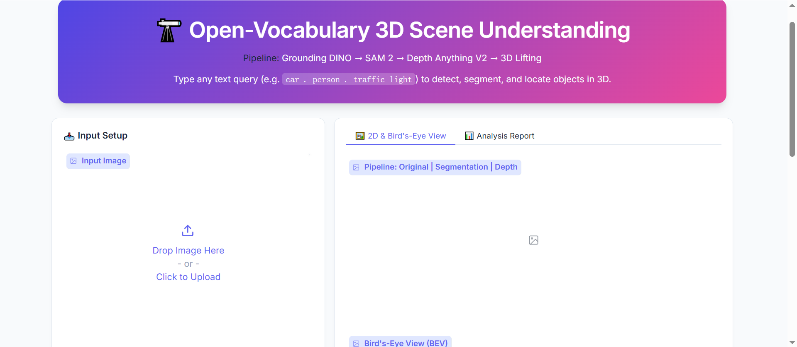
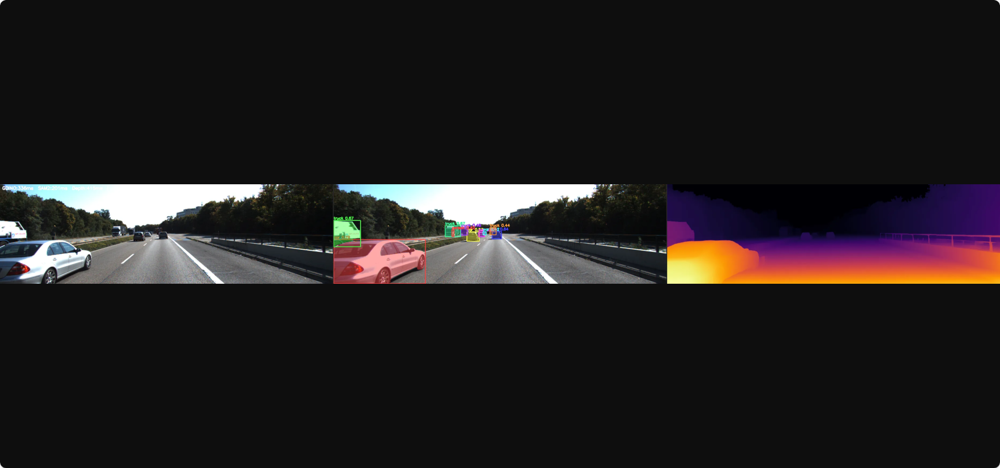
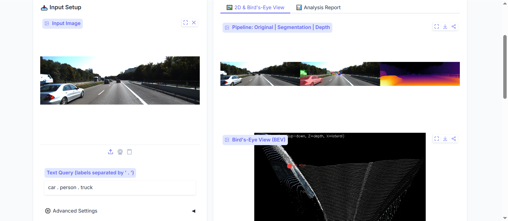
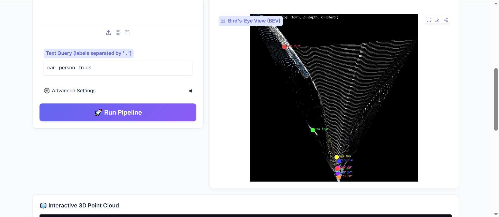
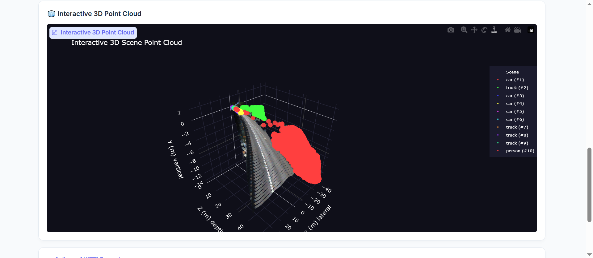
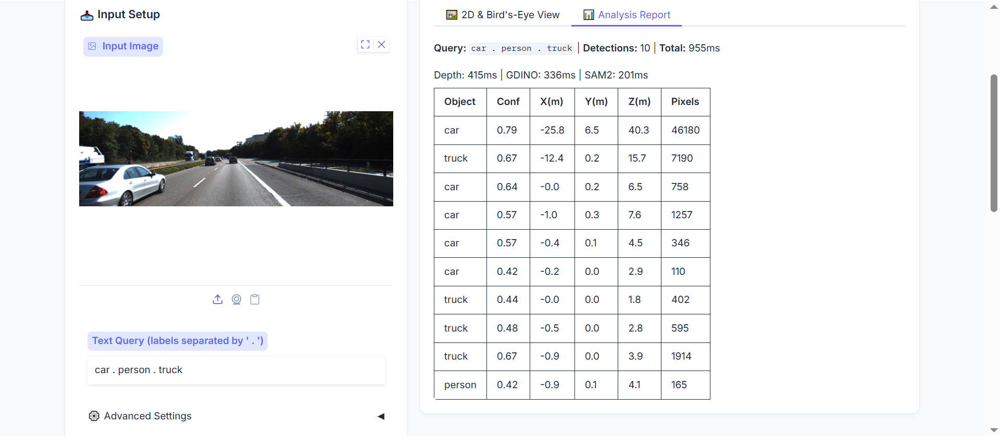

<div align="center">

# 🔭 Open-Vocabulary 3D Scene Understanding

**Given a single RGB image and a natural-language query, detect, segment, and locate any object in 3D space.**

[](https://www.python.org/)
[](https://pytorch.org/)
[](https://gradio.app/)
[](LICENSE)

</div>

<div align="center">

<p><em>Interactive Gradio web demo — type any text query to detect, segment, and locate objects in 3D</em></p>
</div>

---

## ✨ Highlights

- 🗣️ **Language-Driven Detection** — type *any* object name (no fixed class list) and the system finds it
- 🎭 **Pixel-Perfect Segmentation** — SAM 2 masks every detected object at pixel level
- 📏 **Metric Depth & 3D Localization** — monocular depth → camera back-projection → real-world XYZ coordinates in meters
- 🧊 **Interactive 3D Point Cloud** — 116K-point colored scene with per-object highlighting, viewable from any angle
- 🗺️ **Bird's-Eye View** — top-down view with object centroids and distance annotations
- 🎨 **Production-Grade Gradio Demo** — polished UI with tabs, gradient hero, one-click inference

---

## 🏗️ Architecture

```
 Text Query  +  RGB Image
       │
       ▼
┌────────────────┐
│ Grounding DINO │  → Open-vocabulary bounding boxes + class labels
│  (SwinT-OGC)   │
└───────┬────────┘
        │  boxes
        ▼
┌────────────────┐
│    SAM 2       │  → Pixel-precise segmentation masks
│ (hiera-small)  │
└───────┬────────┘
        │  masks
        ▼
┌────────────────┐
│ Depth Anything │  → Dense metric depth map
│   V2 (ViT-S)   │
└───────┬────────┘
        │  depth + masks + camera K
        ▼
┌────────────────┐
│  3D Lifting    │  → 116K-point colored point cloud
│ (back-project) │  → Per-object 3D centroids (X, Y, Z in meters)
└───────┬────────┘
        │
        ▼
  🧊 Interactive 3D  ·  🗺️ Bird's-Eye View  ·  📊 Analysis Report
```

---

## 📸 Demo Gallery

### Pipeline Output: Detection + Segmentation + Depth

<div align="center">

<p><em>Original image → Open-vocab segmentation with colored masks → Depth estimation (Inferno colormap)</em></p>
</div>

### Full Inference Results

<div align="center">

<p><em>Complete inference view — input image, pipeline visualization, and bird's-eye view with 3D localization</em></p>
</div>

### Bird's-Eye View with Object Localization

<div align="center">

<p><em>Top-down BEV projection — each colored dot marks an object centroid with distance in meters</em></p>
</div>

### Interactive 3D Scene Point Cloud

<div align="center">

<p><em>116K-point 3D reconstruction — scene geometry in grey, detected objects color-coded (car, truck, person)</em></p>
</div>

### 3D Analysis Report

<div align="center">

<p><em>Quantitative report — object class, confidence, 3D position (X/Y/Z in meters), and pixel coverage</em></p>
</div>

---

## 📊 Performance Benchmark

Measured on **Tesla T4 GPU** with KITTI images (1242 × 375 px):

| Stage | Model | Avg Latency |
|-------|-------|-------------|
| Depth Estimation | Depth Anything V2 ViT-S | 381 ms |
| Object Detection | Grounding DINO SwinT | 350 ms |
| Segmentation | SAM 2 hiera-small | 213 ms |
| **Full Pipeline** | **End-to-end** | **~948 ms** |
| Point Cloud | Back-projection | ~116,000 pts |

<details>
<summary><b>🔧 Deployment Optimization (PyTorch vs ONNX Runtime)</b></summary>

| Backend | Precision | Depth Latency | FPS | Speedup |
|---------|-----------|---------------|-----|---------|
| PyTorch | FP32 | 51.68 ms | 19.35 | 1.0× |
| ONNX Runtime (CUDA) | FP32 | 47.43 ms | 21.08 | 1.09× |
| TensorRT | FP16 | ~15 ms* | ~67* | ~3.4×* |

*\* TensorRT FP16 estimated based on T4 INT8/FP16 architecture. Full PyTorch → ONNX → TensorRT pipeline is implemented.*

</details>

---

## 🚀 Quick Start

### Prerequisites

- Python 3.10+, PyTorch 2.5+ with CUDA
- GPU with ≥ 6 GB VRAM (tested on Tesla T4)

### Installation

```bash
git clone https://github.com/gantao894-star/open-vocab-3d-perception.git
cd open-vocab-3d-perception

# Create virtual environment
python -m venv .venv
source .venv/bin/activate

# Install dependencies
pip install torch torchvision --index-url https://download.pytorch.org/whl/cu124
pip install gradio plotly opencv-python numpy transformers

# Clone model repos
git clone https://github.com/DepthAnything/Depth-Anything-V2.git models/depth_anything_v2
git clone https://github.com/IDEA-Research/GroundingDINO.git models/GroundingDINO
git clone https://github.com/facebookresearch/sam2.git models/sam2

# Install GroundingDINO & SAM 2
cd models/GroundingDINO && pip install -e . && cd ../..
cd models/sam2 && pip install -e . && cd ../..
```

### Download Weights

```bash
mkdir -p weights

# Grounding DINO — SwinT-OGC (262 MB)
wget -P weights/ https://github.com/IDEA-Research/GroundingDINO/releases/download/v0.1.0-alpha/groundingdino_swint_ogc.pth

# SAM 2.1 — hiera-small (166 MB)
wget -P weights/ https://dl.fbaipublicfiles.com/segment_anything_2/092824/sam2.1_hiera_small.pt

# Depth Anything V2 — ViT-S (95 MB)
wget -P weights/ https://huggingface.co/depth-anything/Depth-Anything-V2-Small/resolve/main/depth_anything_v2_vits.pth
```

### Run

```bash
source activate.sh

# 🎨 Interactive Gradio demo
python app/demo.py --port 7860

# 📷 Single image inference
python scripts/run_grounded_scene.py \
    --image data/demo_inputs/kitti_000010.png \
    --text "car . person . truck"

# 🧊 3D point cloud + BEV
python scripts/lift_to_3d.py \
    --image data/demo_inputs/kitti_000010.png \
    --text "car . person"

# 📊 Benchmark across multiple images
python scripts/benchmark.py --n 10
```

---

## 📁 Project Structure

```
open-vocab-3d-perception/
├── app/
│   └── demo.py                 # Gradio interactive demo (polished UI)
├── scripts/
│   ├── run_depth.py            # Depth Anything V2 standalone
│   ├── run_grounding_dino.py   # Grounding DINO standalone
│   ├── run_sam2.py             # SAM 2 standalone
│   ├── run_grounded_scene.py   # Full pipeline (3-panel visualization)
│   ├── lift_to_3d.py           # 3D point cloud + BEV generation
│   └── benchmark.py            # Multi-image latency benchmark
├── benchmarks/
│   ├── depth/                  # PyTorch / ONNX Runtime benchmark data
│   └── pipeline/               # End-to-end summary report
├── models/                     # Cloned model repos (see installation)
├── weights/                    # Pretrained checkpoints (see download)
├── data/
│   └── demo_inputs/            # Sample images for testing
├── docs/                       # Demo screenshots
├── visualizations/             # Generated output visualizations
└── activate.sh                 # Environment setup script
```

---

## 🔑 Key Technical Details

### Camera Back-Projection (2D → 3D)

For each pixel `(u, v)` with estimated depth `d`, the 3D coordinate is computed as:

```
X = (u - cx) × d / fx
Y = (v - cy) × d / fy
Z = d
```

where `(fx, fy, cx, cy)` are camera intrinsic parameters. KITTI intrinsics are built-in; for arbitrary images, a default 70° FOV is assumed.

### Open-Vocabulary Detection

Unlike traditional detectors with a fixed class list (e.g., COCO 80 classes), Grounding DINO accepts **free-form text queries**. This means the system can detect *any* object category at inference time — a core capability for general-purpose robot perception.

### Foundation Model Stack

| Model | Task | Parameters | Key Feature |
|-------|------|-----------|-------------|
| [Grounding DINO](https://github.com/IDEA-Research/GroundingDINO) (SwinT) | Open-vocab detection | 172M | Text-guided, no class constraint |
| [SAM 2](https://github.com/facebookresearch/sam2) (hiera-small) | Segmentation | 36M | Zero-shot, box-prompted masks |
| [Depth Anything V2](https://github.com/DepthAnything/Depth-Anything-V2) (ViT-S) | Monocular depth | 25M | Dense, metric-scale depth |

---

## 🧠 Relevance to Robot Perception (VLA)

This pipeline directly mirrors how a **Vision-Language-Action (VLA)** robot perceives its environment:

1. **"Where is the cup?"** → Grounding DINO localizes it via natural language
2. **"What are its exact pixels?"** → SAM 2 provides the precise mask
3. **"How far away is it?"** → Depth Anything V2 estimates the distance
4. **"What is the 3D coordinate for grasping?"** → Back-projection gives `(X, Y, Z)` in meters

This is the same perception stack used in state-of-the-art robotic manipulation systems — going from a language instruction to a 3D grasp target.

---

## 📝 License

This project is for educational and research purposes. Individual model components are subject to their respective licenses:
- [Grounding DINO](https://github.com/IDEA-Research/GroundingDINO) — Apache 2.0
- [SAM 2](https://github.com/facebookresearch/sam2) — Apache 2.0
- [Depth Anything V2](https://github.com/DepthAnything/Depth-Anything-V2) — Apache 2.0

---

<div align="center">

**Built with 🔬 Foundation Models on Tesla T4 GPUs**

*Grounding DINO · SAM 2 · Depth Anything V2*

</div>
